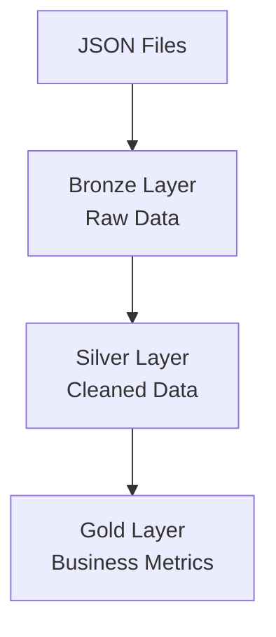

# Databricks-Genie-Medallion-Pipeline

## AI Assisted Medallion Data Pipeline using Databricks Genie

### Overview

This project demonstrated the implementation of Medallion Architecture (Bronze, Silver and Gold layers) using Databricks Genie for AI Assisted Data Engineering.

The pipeline processes synthetic order data generated in JSON format and automatically creates structured data layers to support business analytics.

### Flow diagram of ETL pipeline

### Technologies Used

- Databricks
- Databricks Genie
- Python
- SQL
- Delta Tables
- Medallion Architecture

### Business Requirements

The pipeline was designed to:

1. Ingest JSON Order data.
2. Filter records where order status is 'cancelled'.
3. Implement Bronze, Silver and Gold layers.
4. Generate business metrics:
   - Total sales by city
   - Total orders by status

### Architecture

### Implementation Steps

#### Data Generation

A Python script was used to generate synthetic order data.

#### Databricks Setup

- Created Catalog
- Created Schema
- Created Volume
- Uploaded JSON data generation script in python workspace

#### AI Assisted Pipeline Creation

Databricks Genie was provided business requirements and generated the pipeline workflow.

#### Validation

The generated Bronze, Silver and Gold layers were validated to ensure:
- Correct filtering logic
- Accurate Metric calculations
- Proper Medallion Architecture implementation

### Business Metrics

#### Metric 1

Total Sales by City

#### Metric 2

Total Orders by Status

### ETL Pipeline in Databricks

### Key Learnings

- Medallion Architecture
- AI Assisted Data Engineering
- Databricks Data Organization
- Data Validation Techniques
- Conversational Analytics using Databricks Genie
