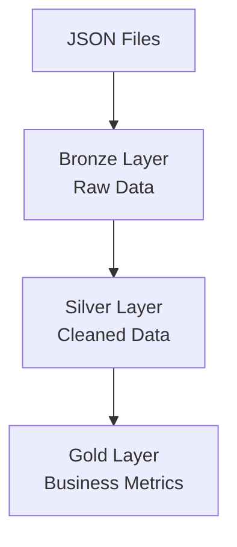

# Databricks-Genie-Medallion-Pipeline

## AI Assisted Medallion Data Pipeline using Databricks Genie

### Overview

This project demonstrated the implementation of Medallion Architecture (Bronze, Silver and Gold layers) using Databricks Genie for AI Assisted Data Engineering.

The pipeline processes synthetic order data generated in JSON format and automatically creates structured data layers to support business analytics.

### Flow diagram of ETL pipeline

### Technologies Used

- Databricks
- Databricks Genie
- Python
- SQL
- Delta Tables
- Medallion Architecture

### Business Requirements

The pipeline was designed to:

1. Ingest JSON Order data.
2. Filter records where order status is 'cancelled'.
3. Implement Bronze, Silver and Gold layers.
4. Generate business metrics:
   - Total sales by city
   - Total orders by status

### Architecture

